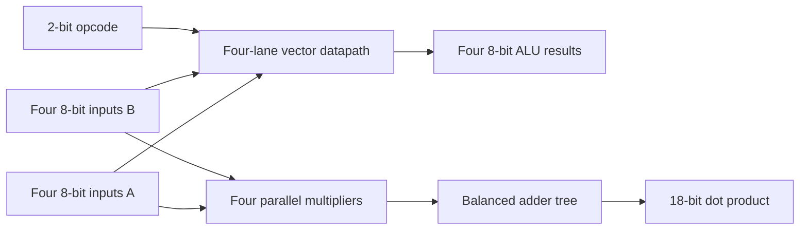

# FPGA Vector Accelerator

[](https://github.com/Murede/fpga-vector-accelerator/actions/workflows/simulate.yml)

A learn-as-I-go SystemVerilog project that documents my progression toward building a small FPGA vector accelerator. Each stage applies a newly learned digital-design concept, progressing from a scalar ALU to parallel vector lanes, registered control, multiply-accumulate (MAC) hardware, signed arithmetic, and matrix-vector processing.

## Learning approach

This repository intentionally preserves the project's incremental development history. I am using it to learn RTL design, verification, and computer architecture by implementing one testable building block at a time. Completed modules are supported by self-checking testbenches, while unfinished ideas remain outside the published design until they are ready to verify.

The goal is not to present this as a finished commercial accelerator. It is a transparent engineering record showing how I translate theory into working SystemVerilog, test assumptions, correct mistakes, and increase the design's complexity as my skills develop.

## Development notebook

My [phase 1-to-5 development summary](docs/development-notes-phases-1-to-5.md) connects each learning milestone to its RTL module, interface decisions, and self-checking testbench. The [original handwritten notes](docs/phase-1-to-5-development-notes.pdf) are also preserved as a record of how the design and verification plan developed.

## Highlights

- Four parallel 8-bit ALU lanes supporting add, subtract, AND, and XOR
- Registered request/completion interfaces with one-cycle `done` signaling
- Unsigned 8-bit multiply-accumulate unit with an 18-bit accumulator
- Parallel four-element unsigned dot product with full-width accumulation
- Iterative four-element vector MAC controller that reuses one multiplier
- Signed MAC datapath and parameterized signed matrix-vector controller
- Self-checking SystemVerilog testbenches covering normal, overflow, hold, reset, and boundary behavior
- Automated simulation on every push and pull request with Icarus Verilog

## Architecture



The maximum unsigned dot-product result is `4 x 255 x 255 = 260,100`, which fits in 18 bits. See [Architecture](docs/architecture.md) for module interfaces, timing, and design decisions.

## Repository layout

```text
.
|-- .github/workflows/   Automated simulations
|-- docs/                Architecture and verification notes
|-- rtl/                 Synthesizable SystemVerilog modules
|-- sim/                 Generated waveforms and executables (ignored)
`-- tb/                  Self-checking testbenches
```

## Implemented modules

| Module | Purpose | Verification |
|---|---|---|
| `alu` | 8-bit scalar arithmetic and logic unit | Self-checking testbench |
| `combinational_vector_alu` | Four parallel scalar ALU lanes | Self-checking testbench |
| `registered_alu` | Registered two-cycle ALU transaction | Self-checking testbench |
| `controller_alu` | FSM-controlled ALU transaction | Self-checking testbench |
| `mac_unit` | Sequential unsigned multiply-accumulate | Self-checking testbench |
| `vector_dot_product` | Four-element parallel dot product | Self-checking testbench |
| `mac_controller` | Iterative four-element vector MAC | Self-checking testbench |
| `signed_mac_unit` | Parameterized signed multiply-accumulate | Self-checking testbench |
| `matrix_multiplier` | Parameterized signed matrix-vector controller | Testbench implemented; unresolved `X` outputs under current Icarus simulation |
| `parallel_dot_product` | Parameterized signed parallel reduction tree | RTL in active development; dedicated testbench pending |
| `parallel_matrix_multiplier` | Row-controlled parallel matrix-vector wrapper | Interface and FSM work in progress; datapath incomplete |

## Run the simulations

Install [Icarus Verilog](https://steveicarus.github.io/iverilog/) with SystemVerilog support, then run these commands from the repository root.

```bash
mkdir -p sim

iverilog -g2012 -Wall -s alu_tb -o sim/alu_tb.vvp rtl/alu.sv tb/alu_tb.sv
vvp sim/alu_tb.vvp

iverilog -g2012 -Wall -s vector_dot_product_tb -o sim/vector_dot_product_tb.vvp rtl/vector_dot_product.sv tb/vector_dot_product_tb.sv
vvp sim/vector_dot_product_tb.vvp
```

The GitHub Actions workflow runs the complete test suite. Testbenches also generate VCD waveform files in `sim/` for inspection with GTKWave.

## Project status

This learn-as-I-go project is actively in development. Eight module-level simulations currently pass locally: the scalar ALU, vector ALU, registered ALU, FSM-controlled ALU, unsigned MAC, fixed four-element dot product, iterative vector MAC controller, and signed MAC.

The signed matrix-vector controller and its testbench are implemented, but a fresh Icarus Verilog run on September 3, 2026 exposed unresolved `X` values at its output. It therefore remains a debugging milestone rather than a verified result. The current local work also develops an arbitrary-length signed parallel dot product and the surrounding parallel matrix-vector controller.

Planned extensions:

- Resolve and verify the signed matrix-vector controller output issue
- Add dedicated signed and non-power-of-two tests for `parallel_dot_product`
- Complete the parallel matrix-vector controller
- Compare iterative and parallel matrix-vector architectures by latency and synthesized resource use
- Add synthesis results for a specific FPGA target
- Integrate on-board I/O and hardware validation

## Engineering focus

This repository demonstrates RTL modularity, finite-state-machine control, datapath sizing, transaction timing, self-checking verification, and continuous integration. It is intentionally kept tool-vendor-neutral while the core architecture is developed.

## Author

Murede Adetiba
