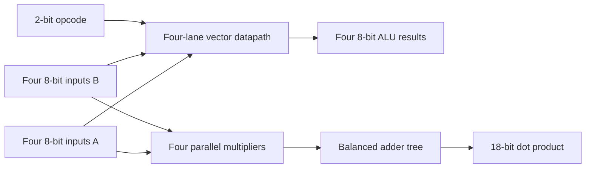

# FPGA Vector Accelerator

[](https://github.com/Murede/fpga-vector-accelerator/actions/workflows/simulate.yml)

A SystemVerilog learning project that develops the arithmetic datapath for a small FPGA vector accelerator. The design progresses from a scalar ALU to four parallel vector lanes, registered control, multiply-accumulate (MAC) hardware, and a four-element dot-product unit.

## Highlights

- Four parallel 8-bit ALU lanes supporting add, subtract, AND, and XOR
- Registered request/completion interfaces with one-cycle `done` signaling
- Unsigned 8-bit multiply-accumulate unit with an 18-bit accumulator
- Parallel four-element unsigned dot product with full-width accumulation
- Self-checking SystemVerilog testbenches covering normal, overflow, hold, reset, and boundary behavior
- Automated simulation on every push and pull request with Icarus Verilog

## Architecture



The maximum unsigned dot-product result is `4 x 255 x 255 = 260,100`, which fits in 18 bits. See [Architecture](docs/architecture.md) for module interfaces, timing, and design decisions.

## Repository layout

```text
.
|-- .github/workflows/   Automated simulations
|-- docs/                Architecture and verification notes
|-- rtl/                 Synthesizable SystemVerilog modules
|-- sim/                 Generated waveforms and executables (ignored)
`-- tb/                  Self-checking testbenches
```

## Implemented modules

| Module | Purpose | Verification |
|---|---|---|
| `alu` | 8-bit scalar arithmetic and logic unit | Self-checking testbench |
| `combinational_vector_alu` | Four parallel scalar ALU lanes | Self-checking testbench |
| `registered_alu` | Registered two-cycle ALU transaction | Self-checking testbench |
| `controller_alu` | FSM-controlled ALU transaction | Self-checking testbench |
| `mac_unit` | Sequential unsigned multiply-accumulate | Self-checking testbench |
| `vector_dot_product` | Four-element parallel dot product | Self-checking testbench |

## Run the simulations

Install [Icarus Verilog](https://steveicarus.github.io/iverilog/) with SystemVerilog support, then run these commands from the repository root.

```bash
mkdir -p sim

iverilog -g2012 -Wall -s alu_tb -o sim/alu_tb.vvp rtl/alu.sv tb/alu_tb.sv
vvp sim/alu_tb.vvp

iverilog -g2012 -Wall -s vector_dot_product_tb -o sim/vector_dot_product_tb.vvp rtl/vector_dot_product.sv tb/vector_dot_product_tb.sv
vvp sim/vector_dot_product_tb.vvp
```

The GitHub Actions workflow runs the complete test suite. Testbenches also generate VCD waveform files in `sim/` for inspection with GTKWave.

## Project status

This project is actively in development. The current milestone implements and verifies the arithmetic building blocks and parallel dot-product datapath. The next milestone is a controller that reuses one MAC unit across four vector elements, enabling an area/latency comparison against the parallel implementation.

Planned extensions:

- Complete and verify the iterative vector MAC controller
- Compare parallel and iterative architectures by latency and synthesized resource use
- Parameterize element width and vector length
- Add synthesis results for a specific FPGA target
- Integrate on-board I/O and hardware validation

## Engineering focus

This repository demonstrates RTL modularity, finite-state-machine control, datapath sizing, transaction timing, self-checking verification, and continuous integration. It is intentionally kept tool-vendor-neutral while the core architecture is developed.

## Author

Murede Adetiba
